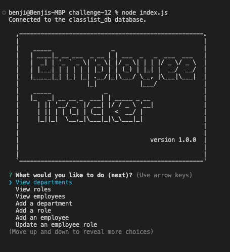

# ReadMe - Module 12 Challenge 📝

## Description 

This app is a command-line content management system, designed to let a user manage a company's employee database, using Node.js, Inquirer, and MySQL.  With the app, you can create and modify items including employees, roles, and departments, as well as see advanced metrics about the organization's makeup.  Be sure to view the 'update an employee manager' and 'view advanced' sections for bonus functionality (deletion has been removed due to resulting database conflicts)

View more info below, as well as a video preview and a screenshot of the app in action.  

Video overview: [link here](https://monosnap.com/file/1jQpKT3Yd7HAYYASv5lBfD0iBKZE7a)

---

## Table of Contents 

* [Descripton](#description)

* [Installation Instructions](#installation-instructions)

* [Usage Information](#usage-information)

* [App License](#app-license)

* [Contribution Guidelines](#contribution-guidelines)

* [Testing Instructions](#testing-instructions)

* [Questions](#questions)

---

## Installation Instructions 

To begin, run NPM install, to add in all necessary node packages.  You can then create and seed the database by loading into the mysql shell ('mysql -u root -p', then password) and running 'source db/schema' and'source db/seeds.'  Once complete, you'll need to add in your database information to the 'Connect to Database' section of the index.js file.  Finally, you can then run 'node index.js' in the terminal and the application will run

---

## Usage Information 

The app provides a variety of functionalities, to help a user view and control data stored in a database.  Once the application is running, you can use the command line prompts to:

* View departments, roles, and employees
* Add departments, roles, and employees
* Update employee roles and managers (bonus)
* View employees by manager, emloyees by department, and budget by department (bonus)
* Exit the application

Note, item deletion has been deprecated due to databse conflicts (ie deletions cascading to linked tables)

---

## App License 

This app is covered under the following license: None

---

## Contribution Guidelines 

This app was developed indepentently, though all suggestions are welcome

---

## Testing Instructions 

Feel free to try finding bugs, although hopefully there shouldn't be any!

---

## Questions 

For more information and questions, please contact me at <bensdecker@gmail.com> or by visiting my [github account](https://github.com/benjiCCB)